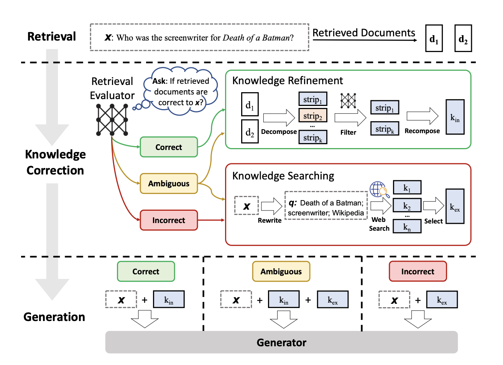

# 🧠 Corrective Retrieval-Augmented Generation (CRAG)

<p align="center">


</p>

<p align="center">
<b>Modular, Provider-Agnostic Implementation of Corrective RAG</b><br>
Based on the paper:<br>
📄 <a href="https://arxiv.org/pdf/2401.15884">Corrective Retrieval Augmented Generation (CRAG)</a>
</p>

---

## 🎯 Overview

This repository implements a **self-correcting Retrieval-Augmented Generation (RAG) pipeline** that evaluates retrieval quality and dynamically applies corrective strategies before answer generation.

Unlike naïve RAG systems, this CRAG implementation:

- ✅ Evaluates each retrieved document using an LLM-based scoring mechanism  
- ✅ Classifies retrieval into **CORRECT / AMBIGUOUS / INCORRECT**  
- ✅ Dynamically rewrites queries when needed  
- ✅ Augments evidence using web search (Tavily)  
- ✅ Performs sentence-level knowledge refinement  
- ✅ Supports both **Groq** and **OpenAI** providers  
- ✅ Runs from a single modular Python file  

---

# 🏗 Architecture

<p align="center">
  
</p>

---

## 🔁 High-Level Pipeline

```
User Query
     ↓
Recursive PDF Loader
     ↓
Text Chunking (RecursiveCharacterTextSplitter)
     ↓
Vector Indexing (FAISS)
     ↓
Retriever (Top-k Similarity Search)
     ↓
LLM-based Document Evaluation
     ↓
Conditional Routing:
    ├── CORRECT
    │     → Internal Knowledge Refinement
    │     → Generate Answer
    │
    ├── AMBIGUOUS
    │     → Query Rewrite
    │     → Web Search (Tavily)
    │     → Merge Internal + Web
    │     → Sentence Filtering
    │     → Generate Answer
    │
    └── INCORRECT
          → Query Rewrite
          → Web Search
          → Replace Evidence
          → Sentence Filtering
          → Generate Answer
```

This routing logic is the core innovation introduced in the CRAG paper.

---

# 📂 Repository Structure

```
CRAG/
│
├── corrective_rag_multi_provider.py
├── documents/
│   ├── book1.pdf
│   ├── book2.pdf
│   └── ...
├── docs/
│   └── crag_diagram.png
├── requirements.txt
└── README.md
```

- All PDFs inside `/documents` are loaded **recursively**
- The entire pipeline runs from one modular Python file

---

# ⚙️ Supported Execution Modes

Provider selection is controlled via environment variables.

---

## 🟣 Groq Mode (Recommended – Fast & Cost Efficient)

```bash
export LLM_PROVIDER=groq
export GROQ_API_KEY=your_groq_key
export TAVILY_API_KEY=your_tavily_key
python corrective_rag_multi_provider.py
```

Embeddings:
- Local SentenceTransformers (`all-MiniLM-L6-v2`)

Best for:
- Fast experimentation
- Low cost
- High throughput

---

## 🔵 OpenAI Mode

```bash
export LLM_PROVIDER=openai
export OPENAI_API_KEY=your_openai_key
export TAVILY_API_KEY=your_tavily_key
python corrective_rag_multi_provider.py
```

Embeddings:
- `text-embedding-3-large`

Best for:
- High-quality evaluation
- Controlled benchmarking

---

# 📦 Installation

## 1️⃣ Create Virtual Environment

```bash
python3 -m venv venv
source venv/bin/activate
```

---

## 2️⃣ Install Dependencies

```bash
pip install -r requirements.txt
```

### Required Packages

```
langchain
langchain-community
langchain-openai
langchain-groq
langchain-huggingface
langchain-text-splitters
langgraph
faiss-cpu
pypdf
sentence-transformers
torch
python-dotenv
tavily-python
```

---

# ▶️ Running the System

```bash
python corrective_rag_multi_provider.py
```

You will be prompted:

```
Enter your question:
```

Example:

```
cricket match total overs in one day international
```

---

# 🧠 Core Components

| Component | Responsibility |
|------------|---------------|
| Recursive PDF Loader | Recursively loads all PDFs from `/documents` |
| Vector Retriever | Chunking + FAISS indexing |
| Retrieval Evaluator | LLM-based scoring of each chunk |
| Query Rewriter | Converts question into search query |
| Web Search Node | Fetches external evidence using Tavily |
| Knowledge Refinement | Sentence-level filtering using LLM |
| Answer Generator | Produces grounded final response |
| LangGraph Router | Controls conditional execution flow |

---

# 🔬 Retrieval Evaluation Logic

Thresholds:

```
UPPER_TH = 0.7
LOWER_TH = 0.3
```

Verdict conditions:

| Condition | Verdict |
|------------|---------|
| Any score > 0.7 | CORRECT |
| All scores < 0.3 | INCORRECT |
| Otherwise | AMBIGUOUS |

---

# 🧪 Debug Transparency

The system prints:

- Retrieval stage
- Document scoring
- Routing decision
- Web query
- Sentence filtering progress
- Final verdict
- Total latency

This ensures full observability of the corrective process.

---

# 🔬 Research Alignment

This implementation operationalizes the CRAG paper by implementing:

- Retrieval quality evaluation
- Conditional correction routing
- Knowledge decomposition
- Sentence-level filtering
- Web augmentation
- Generator-level synthesis over corrected evidence

It translates the research architecture into a fully runnable modular system.

---

# ⚠️ Limitations

- Sentence filtering is sequential (may increase latency)
- No hybrid BM25 integration yet
- No cross-encoder reranking
- No citation-level grounding
- No hallucination risk scoring

The architecture is modular and extensible.

---

# 🚀 Potential Extensions

- Hybrid BM25 + Dense Retrieval
- Reciprocal Rank Fusion (RRF)
- Cross-Encoder Reranking
- Structured JSON Output Mode
- Confidence Scoring
- Hallucination Risk Estimation
- Async Parallel Filtering
- FastAPI Deployment

---

# 📘 Citation

If using this repository, please cite:

```
@article{yan2024corrective,
  title={Corrective Retrieval Augmented Generation},
  author={Yan et al.},
  year={2024}
}
```

Paper:
https://arxiv.org/abs/2401.15884

---

# 📜 License

MIT License

---

# 🏁 Summary

This repository demonstrates how to evolve from naïve RAG into a:

> **Self-evaluating, dynamically routed, corrective retrieval-augmented generation system.**

CRAG transforms passive retrieval into an actively verified reasoning pipeline.